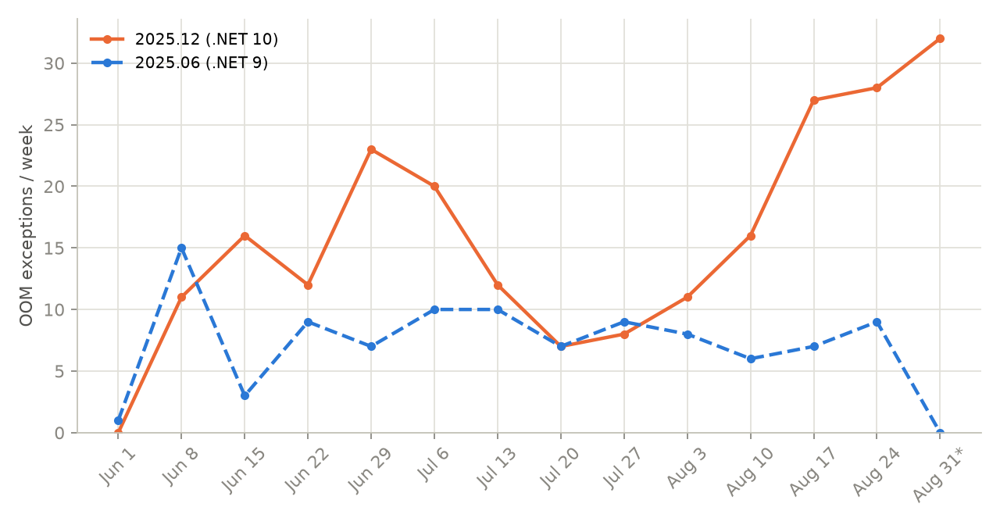
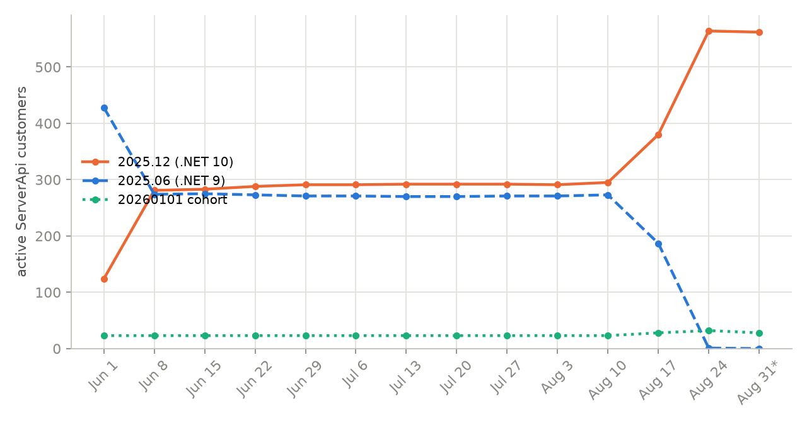
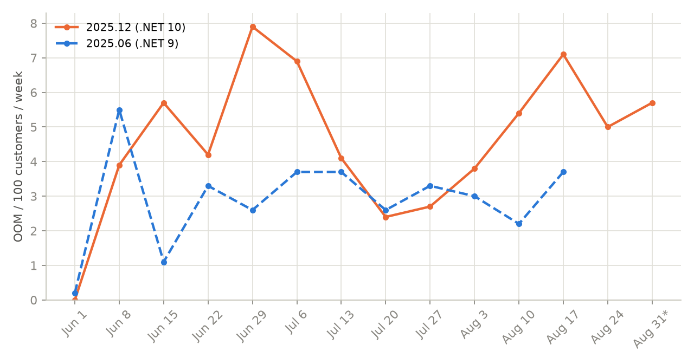
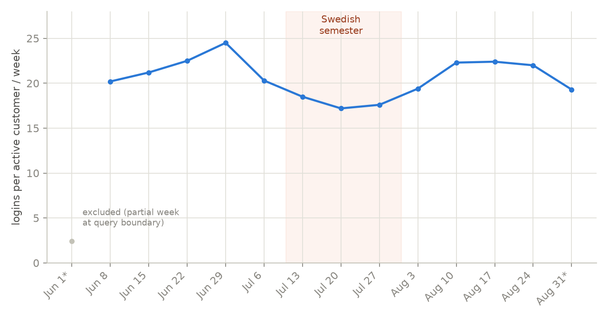
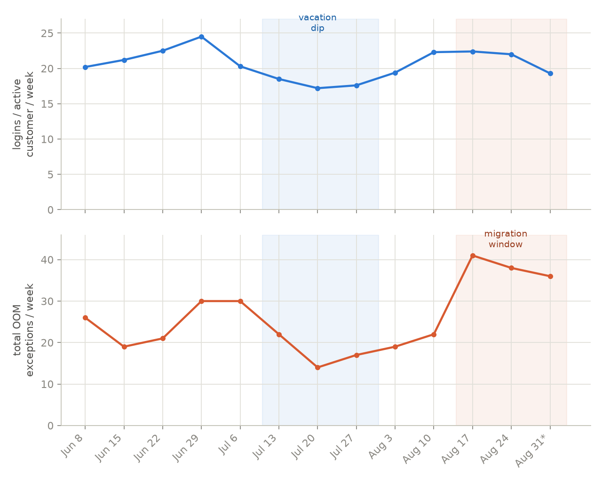

# Incident: OrderCheck search — slow responses, UI freezes, and OutOfMemoryExceptions

**Status:** Under investigation — root cause not fully confirmed, contributing factors identified
**Scope:** Fleet-wide (133 customers, 636 OrderCheck OOM crashes in the last 90 days; 91 customers, 260 crashes in the last 30 days); UI freeze pattern confirmed in detail for one customer
**Date of write-up:** 2026-09-03
**Related:** [PR #13088 "Move OrderCheck search off the UI thread"](https://opter.ghe.com/code/Main/pull/13088) (open since 2026-06-17, unreviewed)

## Summary

Customers searching in Order Control (OrderCheck) intermittently experience either a frozen application (up to 21+ minutes observed) or a hard failure dialog ("Fel vid hämtande av data — Kontakt din systemadministratör"). Both symptoms trace back to the same server-side code path: `OrderCheck.GetAllSimpleResult` → `OrderCheck.LoadSearchResultModelsFromDataSet`. The failure dialog case has been confirmed to be a genuine `System.OutOfMemoryException` server-side, occurring for **133 different customers, 636 times, in the last 90 days** (91 customers, 260 times, in the last 30 days) — this figure includes crashes that fail earlier in the pipeline, during `ExecuteDataSet`'s post-processing step, before execution ever reaches OrderCheck's own C# code (see Fact #3 below; an earlier pass undercounted this by about half). The freeze case has been confirmed via DeadlockWatchdog telemetry to be a real multi-minute block on the UI thread, not a false positive.

For context, OrderCheck accounts for the large majority (~86%) of all `OutOfMemoryException`s in `Opter.Main.ServerApi`: the remaining ~14% (105 occurrences, 24 customers, 90 days) come from unrelated features — the Statistics API, single-order loading, Dispatch, and auto-dispatch route planning — that share the same underlying architectural pattern (see "Other ServerApi OOM sources" below) but are not part of this incident's scope.

Investigation found a long-standing structural weakness in how OrderCheck materializes search results, a client-side design flaw that turns any slow server response into a full application freeze, and a correlation with the .NET 9 → .NET 10 runtime upgrade that shipped between the `2025.06` and `2025.12` release branches. No single root cause has been conclusively isolated; several contributing factors have been identified and are ranked below.

**Update**: the OOM crashes and the UI freezes were initially treated as likely sharing one mechanism (memory pressure). Direct pod telemetry during two independent, known long-freeze windows now argues against that — the pod is idle (flat memory, near-zero CPU) throughout both freezes, not struggling. See "Freeze mechanism" below. The OOM crashes remain a confirmed, undisputed server-side memory/allocation failure; the freezes now look more likely to be a separate mechanism (most plausibly a slow/blocked SQL query) that happens to share the same vulnerable, synchronous-on-the-UI-thread code path.

## Customer impact observed

| Customer | Symptom | Evidence |
|---|---|---|
| Markis City Service AB (`markiscityse`) | UI freezes, no crashes | 263 DeadlockWatchdog freeze episodes in 30 days; several 200-500+ seconds; one 1305-second (21.75 min) outlier on 2026-09-01; affects at least 8 different workstations |
| itide.no | Hard crash, "Fel vid hämtande av data" | Freshdesk ticket #149308, 2026-08-31; log shows `System.OutOfMemoryException` in `OrderCheck.LoadSearchResultModelsFromDataSet` |
| 90 other customers | Same OOM exception | Confirmed via Azure Log Analytics (`Logs_CL`), same underlying bug (both the OrderCheck-labeled and the earlier-in-pipeline manifestation — see Fact #3), 91 distinct customers total (260 occurrences) in the last 30 days |

Notably, Markis City Service — the customer with by far the most severe and frequent *freezes* — has **zero** OOM exceptions in the same 30-day window. Freezing and crashing are related symptoms of the same code path but are not the same event, and don't always co-occur for the same customer.

## Evidence: OOM trend and version migration (90 days, weekly)

**Methodology note (customer counts)**: customer counts below are scoped to `Assembly == "Opter.Main.ServerApi"` only, with one version picked per customer per week (`arg_max` by time). An earlier pass counted a customer as "active on version X" if *any* of their services (across `Client`, `ServerApi`, `Web.App`, `MessageServer`, unrelated components like `FAQ.Routing`, etc.) reported that version prefix — this let a single customer be counted into multiple, non-mutually-exclusive branch buckets in the same week, and pulled in an unrelated component (`Opter.FAQ.Routing`, static version `1.0.0.0`, unrelated to release branches) that inflated an "other" bucket with no real meaning. That first pass is not used below; the charts and numbers here use the corrected, single-assembly methodology.

**Methodology note (OOM counts)**: the OOM figures and charts below use the *complete* OrderCheck definition — `Exception has "OrderCheck"`, `Exception has "LoadSearchResultModelsFromDataSet"`, or `Message has "k2_orc_get_all"` — which captures crashes regardless of whether they happen inside OrderCheck's own C# code or one step earlier, during `ExecuteDataSet`'s generic post-processing (where the stack trace never mentions "OrderCheck" even though the query being executed is `k2_orc_get_all`/`k2_orc_get_all_by_all`). An earlier pass used only the first two conditions and undercounted OrderCheck's true OOM total by roughly half (see "Other ServerApi OOM sources" below for the full breakdown and how this was found). All charts in this section were regenerated with the corrected definition.

What these show:
- **The `2025.06` → `2025.12` migration was sharp, not gradual**: `2025.06`'s active customer count holds steady around 270-280 for the first 11 weeks, then collapses to 187 → 1 → 0 across the final three weeks (2026-08-17 through 2026-08-31), while `2025.12` correspondingly jumps from ~290-295 to 380 → 564 → 562 in the same window. Essentially the whole remaining `2025.06` fleet moved in a two-week span.
- **Total ServerApi-active customer count is flat (~575-597) across the entire 90 days** — there is no visible dip in *customer presence* through late June/July. An earlier informal read of a (since-discarded, methodologically flawed) chart suggested a summer-vacation dip in this data; that claim is retracted as originally stated (customer *presence* doesn't dip) but the underlying intuition is confirmed by a better metric below.

- **Usage *intensity* does dip for the Swedish vacation period, even though customer *presence* doesn't.** Raw `Logs_CL` row count turned out to be a poor proxy (dominated by background/infrastructure noise — it's actually *higher*, not lower, across the presumed vacation weeks, which is itself a sign it isn't measuring real usage). Login events ("User logged in to Opter client") are a cleaner signal: logins per active customer per week peaks at 24.5 in late June, drops to 17.2-18.5 across mid-to-late July (weeks of Jul 13, 20, 27 — roughly the concentrated Swedish "semester" period, weeks 28-31), then recovers to the low-20s by August. That's a genuine ~25-30% dip in usage intensity, distinct from and not visible in the customer-*presence* data. The first data point (Jun 1) is excluded as an artifact of the query's 90-day boundary (partial week).

- **The vacation dip and the migration wave are two separate, additive effects on the OOM count, not one confounding the other — though the correlation is more modest than an earlier pass reported.** Total weekly OOM count (summed across all versions, corrected definition) correlates with login volume at **r = 0.46** during the stable pre-migration window (2026-06-08 through 2026-08-10) — weaker than the r = 0.63 calculated against the earlier, undercounted OOM series (that series was missing about half the true OrderCheck OOM volume, concentrated unevenly across weeks, which distorted the correlation). The two curves still broadly move together — both dip through the vacation weeks (OOM bottoms at 31/week on Jul 13, logins bottom at 17.2/week on Jul 20, one week apart rather than the same week) — but a single anomalous week (Jun 8, where `2025.06` alone accounts for 44 of that week's 66 OrderCheck OOM exceptions, concentrated rather than spread across customers) weakens the fit. Full-13-week correlation (including the migration window) is r = 0.52. The migration window (Aug 17 onward) still visibly decouples the two series: login volume stays roughly flat (~22/week) while total OOM count jumps from 40 (Aug 10) to 72 (Aug 17), driven by branch composition rather than usage.
- **A third cohort exists on a separate `20260101.*` build family (~23-32 tenants throughout the period), but it is not production customer traffic** — confirmed (per engineering input) to be internal support/demo environments only, with no real production customers on it as of this write-up. Its OOM occurrences (7, 1, 4 in the final three weeks) and its distinct memory profile (see the idle-baseline check below, where it comes out *lower* than either real production branch) should be read as internal-environment behavior, not customer impact, and excluded from any production-risk comparison.
- **The incidence-rate gap holds up under the corrected OOM definition, though it's noisier week-to-week than "consistently double."** Normalizing OOM count by active customers per branch per week, `2025.12` averages **8.7** exceptions per 100 customers across the 12 comparable weeks (before the final two weeks' customer counts become too small to trust), versus `2025.06` averaging **6.5** — about 1.35x, down slightly from the 1.55x calculated against the undercounted series. `2025.12` runs higher in 8 of those 12 weeks; `2025.06` is actually higher in the other 4 (including the very first week, and the Jun 8 anomaly above). The gap is a real, persistent tendency across enough weeks to be meaningful — not a rule that holds in every single week.
- **Idle-moment memory baseline confirms the .NET 9 → .NET 10 gap directly, controlling for both pod age and actual idleness** — this is a stronger check than the earlier "settled" comparison, which only controlled for pod age and could still be measuring workload variance. Filtering to samples where `Cpu <= 2` (essentially zero — the pod is not processing anything) on pods at least 6 hours old:

  | Branch | Avg idle memory | Median | P90 | Samples | Pods |
  |---|---|---|---|---|---|
  | `2025.06` (.NET 9) | 21.6% | 20.6% | 33.9% | ~3.96M | 436 |
  | `2025.12` (.NET 10) | 24.0% | 23.1% | 38.1% | ~5.02M | 572 |
  | `2026.06` (.NET 10) | 24.7% | 20.9% | 38.1% | 497 | 4 |
  | `2026.07` (.NET 10) | 24.3% | 26.2% | 26.4% | 261 | 2 |

  The two well-powered production branches (436 and 572 pods, millions of idle samples each) show a clean, robust ~2.4-percentage-point gap (~11% relative) at genuinely idle moments. The newer .NET 10 branches cluster with `2025.12`, not with `2025.06` — consistent with a runtime-driven effect rather than something specific to `2025.12`'s own code. (The `20260101` cohort, which sits *lower* than both, is excluded from this comparison — see above, it's internal/demo environments, not production traffic, and shouldn't be read as a counterexample.)

## Facts (directly observed/confirmed)

1. Multiple customers have reported slow OrderCheck searches and hard error dialogs.
2. At least one confirmed case (itide.no, ticket #149308, 2026-08-31) traced the error dialog directly to a server-side `System.OutOfMemoryException` thrown in `Opter.Main.Server.Orders.OrderCheck.OrderCheck.LoadSearchResultModelsFromDataSet`, called from `GetAllSimpleResult`.
3. The identical underlying bug has occurred for **91 distinct customers, 260 times, in the last 30 days** (133 customers, 636 times, in the last 90 days) — this is a fleet-wide issue, not isolated to one customer. This figure combines two manifestations of the same root cause: crashes where the stack trace explicitly names `OrderCheck`/`LoadSearchResultModelsFromDataSet` (the manifestation an earlier pass of this investigation counted alone — 260/91 90-day, i.e. undercounting by about half), and crashes that fail one step earlier in the pipeline, inside `DatabaseAccess.ExecuteDataSet`'s post-processing (`AdjustTimeZoneToLocalTime`), before execution ever reaches OrderCheck's own C# code — identifiable only via the `Message` field, which logs the actual stored procedure called (`k2_orc_get_all`/`k2_orc_get_all_by_all`). See "Other ServerApi OOM sources" below for how this was found and what else shares the same underlying pattern.
4. DeadlockWatchdog logs confirm genuine multi-minute UI-thread freezes for Markis City Service: 263 episodes over 30 days, several 200-500+ seconds, one 21-minute outlier, all tied specifically to `OrderCheckViewModel.get_SearchCommand` → `GetAllSimpleResult`.
5. The client makes this call **synchronously on the UI thread**: `SearchCommand` is a plain (non-async) `RelayCommand` whose handler calls `CallerBase.RestCall`, which blocks via `.GetAwaiter().GetResult()`. Confirmed by direct code inspection ([OrderCheckViewModel.cs](../../Main/Order/ViewModels/Order/OrderCheck/WPF/OrderCheckViewModel.cs), [CallerBase.cs](../../Main/ServerProxy/CallerBase.cs)), not inferred.
6. Freezes cluster across multiple users/machines within the same time windows (observed in Markis City Service's data — e.g. MC040 and ANDREAS-LAPTOP both froze for 295-499s within minutes of each other on 2026-09-02).
7. **Not all freezes correlate with OOM crashes.** Markis City Service had 263 freeze episodes but zero OOM exceptions in the same period.
8. `releases/2025.06` targets **.NET 9.0**; `releases/2025.12` (and `master`) target **.NET 10.0** — confirmed via `.csproj` (`ServerApi/Opter.Main.ServerApi.csproj`).
9. Customers on `2025.12` show a higher OOM incidence than customers on `2025.06` on average, using the corrected (complete) OOM definition: **8.7 vs. 6.5 exceptions per 100 active customers per week** on average across the 12 comparable weeks (~1.35x) — `2025.12` runs higher in 8 of those 12 weeks, `2025.06` in the other 4 (see "Evidence: OOM trend and version migration" above for the full breakdown; this replaces an earlier, undercounted calculation that showed a ~1.55x gap and overstated its week-to-week consistency). `2025.12` also shows higher peak ServerApi pod memory (91.9% max vs 54.4% max of the pod's 1000 MB container limit, in the settled 6-24h-uptime window). The rate gap is present from the first week of the 90-day window, before the `2025.06`→`2025.12` migration wave accelerated — it is not an artifact of the migration itself, though it is noisier week-to-week than a clean, monotonic law.
10. No explicit GC tuning exists anywhere in the stack — not in any `.csproj`, not in `ServerApi/Dockerfile`, not in the shared base image (`VersionBuilder/BaseImage/Dockerfile`, which is just `mcr.microsoft.com/dotnet/aspnet:10.0` + fonts). Both .NET 9 and .NET 10 builds run on stock GC defaults (`System.GC.Server: true`, the SDK default for ASP.NET Core apps).
11. **No substantive functional diff exists between `2025.06` and `2025.12`** for `OrderCheck.cs`, `ModelBase.cs` (incl. `Clone<T>()`), `OrderCheckSearchResult.cs`, or `k2_orc_get_all_by_all.sql`, beyond CSharpier reformatting and two trivial (2-10 line) additions (an access-attribute annotation, and loading one extra string field `SHI_SubcontractorResource`). This is a direct branch-to-branch comparison (`git diff`/`git log releases/2025.06..releases/2025.12`), which lists every commit present in `2025.12` but not `2025.06` regardless of how old it is — it is **not** time-boxed, and already surfaced commits from November 2025 and February 2026. So this rules out a code-level explanation across the full lifetime of both branches, not just recent history. (An earlier, separate "any changes in the last 3 months" check was run first and is superseded by this — that check was time-boxed and would have missed older changes on its own; it is not independent evidence and shouldn't be read as such.)
12. For Markis City Service's shared SQL elastic pool (`opterproductionsweden1c`), CPU %, Data IO %, and Workers % all sit comfortably within headroom over the last 7 days (CPU peaks ~40-50%, Data IO ~20-25%, Workers near 0%). Aggregate resource exhaustion is ruled out for that pool, on those three metrics.
13. **During two independent, known long-freeze windows (21.75 min on 2026-09-01, 8.65 min on 2026-09-02), the ServerApi pod serving Markis City Service shows flat memory and near-idle CPU throughout** — not the elevated CPU / climbing memory a GC-thrashing or memory-pressure event would produce. See "Freeze mechanism" below for the full data. This directly weighs against memory pressure as the cause of these specific freezes.
14. **Markis City Service runs a single ServerApi pod replica at a time — no horizontal autoscaling per customer.** Every pod-name change in the telemetry has a non-overlapping time range (one instance's samples end before the next begins), consistent with sequential rolling redeploys, not concurrent scale-out. There is no "spin up a second pod under load" mechanism to account for during a freeze.
15. **`2025.12`/.NET 10 pods sit at a genuinely higher idle memory baseline than `2025.06`/.NET 9 pods, confirmed directly rather than by correlation.** Filtering `PodResourceUsage_CL` to samples where `Cpu <= 2` (essentially zero) on pods at least 6 hours old (past cold-start ramp-up) — i.e. the pod is verifiably idle, not just "settled" — `2025.12` averages 24.0% of its memory limit at rest vs `2025.06`'s 21.6% (~2.4pp / ~11% relative gap), across 572 and 436 production pods respectively and millions of samples each. Newer .NET 10 branches (`2026.06`, `2026.07`) cluster with `2025.12`, not `2025.06`. A `20260101` cohort that appeared to buck this trend (lower than both) is confirmed (per engineering input) to be internal support/demo environments with no real production customers — excluded from this comparison as not representative.

## Strong inferences (well-supported, not directly measured)

- **The server was genuinely slow to respond during freezes, not the client hanging on its own.** The UI thread was observed blocked *inside* the outbound REST call for up to 21 minutes (via DeadlockWatchdog stack traces showing the wait inside `CallerBase.RestCall`/`Task.InternalWait`). Nothing else explains a call staying outstanding that long.
- **`LoadSearchResultModelsFromDataSet`'s reflection-based `Clone<T>()` fan-out is the mechanical cause of the OOM crashes.** Its role in the *freezes* specifically is now weaker than earlier reasoning suggested — see "Freeze mechanism" below; it may still contribute to ordinary slowness on moderately-large searches (the CPU cost of reflection over ~350 properties per cloned row is real regardless of freeze duration), but it is no longer the leading explanation for multi-minute freezes specifically. Mechanism, from code inspection ([OrderCheck.cs:221-306](../../Main/Server/Orders/OrderCheck/OrderCheck.cs)):
  - `GetAllSimpleResult` loads the **entire** multi-table result into an in-memory `DataSet` via `_databaseAccess.ExecuteDataSet(...)` — no streaming (`SqlDataReader`), no row cap, no `TOP`/pagination anywhere in the SQL layer either (`k2_orc_get_all` → `k2_orc_get_all_by_all` → the 2816-line `k2_search_deliveries_common_output`, ~200+ output columns).
  - `LoadSearchResultModelsFromDataSet` materializes one `OrderCheckSearchResult` object per row — a wide DTO with ~350 properties.
  - For Consignment/Shipment/PriceItemCost search modes, every shipment/price-item beyond the first calls `ModelBase.Clone<T>()` ([ModelBase.cs:76-100](../../Main/Model/ModelBase.cs)), which reflects over **all ~350 properties** to produce a full duplicate object — not a lean child row. A delivery with 10 shipments costs 11 full-size objects instead of 1 large + 10 small. This is an O(rows × fanout) memory (and CPU) multiplier with no ceiling.
  - No safeguard exists anywhere: no max-row check, no warning, no TODO acknowledging the risk.

## Freeze mechanism: pod telemetry during known freeze windows

Earlier reasoning treated pod memory pressure as a plausible cause of both the OOM crashes and the intermittent freezes — the logic being that a pod running chronically close to its memory ceiling would need more frequent/expensive GC passes, which could stall request processing without necessarily crashing. Checking this directly, against fine-grained (5-minute-interval) pod telemetry during two independent, precisely-known freeze windows, does not support it.

**21.75-minute freeze, Markis City Service, 2026-09-01, 07:23:55–~07:45** (pod `markiscityse-serverapi-79f9ff95cf-jt2d8`):

| Time | Memory | CPU (of 1000) | Status |
|---|---|---|---|
| 07:20:14 | 536 MB (53.6%) | 1 | Running |
| 07:25:22 | 536 MB | 1 | Running |
| 07:30:35 | 536 MB | 1 | Running |
| 07:35:44 | 556 MB | 4 | Running |
| 07:40:54 | 556 MB | 1 | Running |
| 07:46:02 | 556 MB | 4 | Running |

**8.65-minute freeze (519s), Markis City Service, 2026-09-02, 12:42:01–~12:50** (pod `markiscityse-serverapi-59f988677b-fsbfl`):

| Time | Memory | CPU (of 1000) | Status |
|---|---|---|---|
| 12:38:28 | 439 MB | 96 (pod warm-up, *before* the freeze starts) | Running |
| 12:43:39 | 487 MB | 2 | Running |
| 12:48:50 | 487 MB | 1 | Running |
| 12:54:01 | 484 MB | 1 | Running |

Both windows: flat memory, near-zero CPU, `Restarts: 0`, `Status: Running` throughout the freeze itself. This is a pod sitting idle — not one doing GC work or struggling under memory pressure. If pod-wide memory exhaustion caused a 10+ minute stall, the pod would be visibly *busy* during that time (elevated CPU from GC, and/or memory climbing toward the limit); it is not.

**Implication**: the freeze and the OOM crash are more likely two separate mechanisms sharing the same vulnerable, synchronous code path, not one mechanism (memory pressure) manifesting at two severities. The pod being idle during a freeze points toward the client being blocked on something outside the pod's own resource usage — most plausibly the SQL query itself (execution time, or lock/blocking contention on the DB side), which elevates the "slow SQL response" hypothesis (see Hypotheses below) as the more likely explanation for freezes specifically, while leaving the OOM crash mechanism (`Clone<T>()` fan-out exhausting the pod's memory on a large-enough result) unchanged and still the confirmed cause of the crashes.

This was checked on 2 of 263 freeze episodes for one customer — a real, replicated pattern, not exhaustive proof it holds for every freeze fleet-wide.

## Other ServerApi OOM sources (why OrderCheck's count needed correcting)

Checking `Assembly == "Opter.Main.ServerApi"` for **every** `OutOfMemoryException` in the last 90 days, regardless of feature, splits cleanly into two groups:

| | Occurrences | Distinct customers |
|---|---|---|
| OrderCheck (complete definition — see methodology note above) | **636** | **133** |
| Everything else in ServerApi | **105** | **24** |

OrderCheck is ~86% of all ServerApi OOM crashes fleet-wide. The "everything else" bucket breaks down as:

| Source | Occurrences | Customers | Feature |
|---|---|---|---|
| `System.Data.Common.DecimalStorage.Get` | 34 | 1 | Unidentified — concentrated in a single customer hitting a different repeated OOM |
| `Opter.Main.Server.Dispatching.DispatchV2.ParseDataContainer` | 21 | 2 | Dispatch |
| `k2_stat_api_query_by_changed` (via generic `ExecuteDataSet`/`AdjustTimeZoneToLocalTime`) | 30 | 3 | Statistics API — bulk change-export over a wide date range |
| `System.Data.Common.Int32Storage.Get` | 9 | 2 | Unidentified |
| `k2_ods_get_order` (via generic `ExecuteDataSet`) | 5 | 4 | Single-order data-structure load |
| `Opter.Main.Order.AutoDispatching.AutoDispatch.GetRoutePlans` / `QueueItem` | 13 + 7 | 1 each | Auto-dispatch route planning |
| Long tail (~15 distinct causes) | ~1-4 each | mostly 1 | Scattered, various mechanisms |

**How the OrderCheck undercount was found**: the original filter (`Exception has "OrderCheck"` or `"LoadSearchResultModelsFromDataSet"`) missed every case where the `OutOfMemoryException` fires *before* control reaches OrderCheck's own C# code — specifically, inside `DatabaseAccess.ExecuteDataSet`'s generic post-processing step (`AdjustTimeZoneToLocalTime`, which walks the freshly-loaded `DataSet` adjusting date/time columns, itself unbounded and equally capable of exhausting memory on a large result set). When the crash happens there, the stack trace never contains the word "OrderCheck" — but the `Message` field logs the actual stored procedure invoked, and checking that revealed **300 of the 90-day total came from `k2_orc_get_all`/`k2_orc_get_all_by_all`** (OrderCheck's own stored procedure) despite not matching the original filter. The same generic `ExecuteDataSet`/`AdjustTimeZoneToLocalTime` code path is shared by several other features (Statistics API, single-order load), which is how those were discovered as genuinely separate, smaller sources.

**Implication**: the root-cause fix (row cap and/or streaming, see Recommended next steps) belongs at the shared `DatabaseAccess.ExecuteDataSet`/`AdjustTimeZoneToLocalTime` layer, not solely in OrderCheck's `LoadSearchResultModelsFromDataSet`. OrderCheck is overwhelmingly the biggest instance of this pattern, but not the only one — a fix scoped only to OrderCheck's `Clone<T>()` fan-out would leave the Statistics API, Dispatch, and auto-dispatch instances of the same underlying weakness in place.

## Open questions / not yet ruled out

- **Database vs. pod as the source of slow response — unresolved.** We've ruled out *aggregate* SQL resource exhaustion for one customer's elastic pool on three metrics (CPU/IO/Workers), but:
  - Lock/blocking contention is invisible to those metrics and has not been checked (would need Query Store or a live blocking-chain capture during an incident).
  - No other customer's database has been examined.
  - No actual execution plan for `k2_orc_get_all_by_all` has been pulled.
- **The .NET 9→10 idle memory baseline gap is now confirmed as a real, robust effect (not just correlation) — the specific GC mechanism behind it is still unverified.** The idle-moment check above (controlling for pod age and actual idleness, ~1000 pods, millions of samples) confirms `2025.12`/.NET 10 pods sit ~2.4 percentage points higher at true rest than `2025.06`/.NET 9, with newer .NET 10 branches (`2026.06`, `2026.07`) clustering the same way. That rules out "it's just workload/traffic differences" as the explanation for the baseline gap. What's still unverified is *why*: we have not checked .NET's actual GC release notes to confirm what, if anything, changed in Server GC's container-memory-limit heuristics between .NET 9 and .NET 10 — the "GC trades memory for throughput" explanation remains the leading candidate, not a confirmed mechanism.
- **Sample size caveat, updated**: with the corrected weekly counts and the corrected (complete) OOM definition, the `2025.06` (.NET 9) group ranges from ~270-280 customers down to single digits as the migration completes, vs. ~290-570 on `2025.12` (.NET 10). `2025.12` runs a higher incidence rate in 8 of 12 comparable weeks (`2025.06` higher in the other 4) — a real average gap (~1.35x) but not a rule that holds every week. The final two weeks of `2025.06` data are excluded from the rate comparison (fewer than 10 remaining customers, and a weekly-binning artifact around the mid-week migration cutover — see "Evidence" section above).
- ~~Whether the OOM-triggering searches and the freeze-triggering searches represent different severities of the same problem~~ — leaning no, see "Freeze mechanism" above: pod telemetry during two known freezes shows no sign of memory pressure, arguing they're separate mechanisms sharing the same code path rather than one mechanism at two severities. Not conclusively ruled out fleet-wide (checked on 2 episodes for one customer), and whether the two symptoms share a common *search size/selectivity* trigger (independent of mechanism) is still open.
- **Migration velocity from `2025.06` to `2025.12` has now been measured directly** (see "Evidence" section above) — it was not a slow drift but a sharp two-week transition (2026-08-17 to 2026-08-31). This confirms the mechanism (more customers moving onto the higher-incidence branch increases fleet-wide absolute counts) but the *rate* gap itself predates and is independent of the migration timing.
- ~~Not yet built: a usage-volume view~~ — built (see "Evidence" section above, login-based chart). Confirms a genuine ~25-30% dip in usage intensity during the Swedish vacation period, distinct from customer presence (which stays flat).
- ~~Cross-check the vacation dip against the OOM weekly series~~ — done, see "Evidence" section above. **Two distinct, additive effects on the same metric, confirmed quantitatively (using the corrected, complete OOM definition)**: usage volume (login rate) correlates with total weekly OOM count at **r = 0.46** during the stable pre-migration window (2026-06-08 through 2026-08-10), rising slightly to r = 0.52 once the migration weeks are included — the migration window still visibly *decouples* the two (logins stay roughly flat at ~22/week while OOM count jumps from 40 to 72, driven by branch composition, not usage), but the correlation is more modest than an earlier pass reported (that pass used the undercounted OOM series). Both the vacation effect and the migration effect are real; they just dominate on different weeks, and neither is as clean a signal in isolation as the combination suggests.

## Hypotheses (plausible, unconfirmed)

- **.NET 10's Server GC commits more memory relative to the container limit than .NET 9 did, for the same workload, as a performance/throughput tradeoff.** The *effect* (higher idle memory baseline on .NET 10) is now confirmed directly (Fact #15, idle-moment check controlling for pod age and actual idleness — not just correlation across noisy windows). The *specific GC mechanism* remains the hypothesis part, unverified against .NET's actual release notes. Leading candidate explanation for the fleet-wide ServerApi memory-plateau shift (every `serverapi` pod, across ~1000 sampled production pods, climbs from ~150-230 MB at cold start to a higher settled plateau within 6-24 hours and stays there, with no restarts/crash-loops — i.e. not a leak in the classic sense, a sustained plateau, and higher on .NET 10 than .NET 9 even at genuinely idle moments).
- The `2025.06` → `2025.12` customer migration (now confirmed as a sharp two-week transition around 2026-08-17 to 2026-08-31, see "Evidence" section above) is why fleet-wide OOM/slowness incident *counts* have trended upward (31-59/week through June-July → 51-72/week by mid-to-late August, using the corrected complete OOM definition) — this mechanism is now directly supported by data, though the underlying *rate* difference between branches predates and is independent of the migration itself.
- **Slow SQL response is now the leading hypothesis for the freeze symptom specifically** (query-plan degradation on broad/unselective searches, from `k2_orc_get_all_by_all`'s forced `INNER LOOP JOIN` hints across `DEL_Delivery`/`SHI_Shipment`/`ADR_Address`/`RCU_ResourceCreditingUnit`), promoted from "plausible, independent of the memory story" now that direct pod telemetry argues against the memory-pressure explanation for freezes (see "Freeze mechanism" above). Still unconfirmed without an actual execution plan or blocking-chain capture — see Recommended next steps.

## Timeline of relevant code changes

- **2026-01-21** — `f52905ab7c`, "Load SHI_SubcontractorResource on search" (#12064): +2 lines to `OrderCheckSearchResult.cs`, loads one additional string field. Negligible impact.
- **2026-02-04** — `6523365d63`, "Server access attributes" (#12144): 334 files, adds `[MethodAccessAttribute(...)]`-based access-control checks across nearly every server method, including the OrderCheck path (10-line change to `OrderCheck.cs`). Largest behavioral diff found between `2025.06` and `2025.12`; plausible source of added per-call overhead, though not confirmed to affect memory specifically.
- **2026-06-17** — [PR #13088](https://opter.ghe.com/code/Main/pull/13088) opened: "Move OrderCheck search off the UI thread" — wraps `GetAllSimpleResult` in `Task.Run`, makes `SearchCommand` async, adds a busy-indicator overlay. CI green, Copilot review comments addressed, **still awaiting human review/merge** as of this write-up (2.5+ months open).
- **2026-06-23** — `a651ce02df` / `2ebbe93594` / `b3cfc63f45`, "Include schedule search data for all schedule columns" (#13117): one-line change to `k2_search_deliveries_common_output.sql`, broadens which customers' searches include an extra block of "schedule" columns (6 more `OCO_OCC_Id` values trigger the branch). Widens result-set columns for affected customers; contributes to per-row memory footprint but does not by itself explain the fleet-wide pattern.
- **No changes found** to `OrderCheck.cs`, `ModelBase.cs`, `OrderCheckSearchResult.cs`, or `k2_orc_get_all_by_all.sql` in the 3 months preceding this investigation (2026-06 through 2026-09), beyond the items above and pure CSharpier reformatting.

## Recommended next steps, roughly in order of effort

1. **Get [PR #13088](https://opter.ghe.com/code/Main/pull/13088) reviewed and merged.** It doesn't fix the underlying slowness or crash, but it converts "frozen, unresponsive application for up to 21 minutes" into "visible busy spinner while a slow operation completes" — a major UX improvement for the exact same underlying condition, ready to ship today.
2. **Confirm or rule out SQL-side contribution to the freezes**: get blocking-chain/Query Store access for one affected customer during a live incident, and pull an actual execution plan for `k2_orc_get_all_by_all` under a broad/unselective search. Moved up — this is diagnostic work, not a code change, and now targets the leading hypothesis for the freeze symptom specifically (see "Freeze mechanism" above: pod telemetry during two known freezes rules against memory pressure as the cause, pointing at the SQL query itself instead). Worth doing before investing in the bigger code fixes below, since it determines whether those fixes will actually address the freezes or only the OOM crashes.
3. **Replace `Clone<T>()`'s reflection fan-out in `LoadSearchResultModelsFromDataSet`** with a lean child-row DTO for the shipment/price-item fan-out, instead of duplicating the full 350-property object per child row. Addresses the OOM crashes at the mechanical root, with no change to what a user can search for; likely helps ordinary slowness on moderately-large searches too, though probably not the multi-minute freezes specifically (see "Freeze mechanism" above). The biggest-impact OrderCheck-specific code fix identified for the OOM track.
4. **Move `DatabaseAccess.ExecuteDataSet` (and OrderCheck's use of it) from buffering the whole result in memory to a streaming/paginated read** — deliver results progressively (first page immediately, rest loaded in the background, or an explicit "preparing your export" flow for very large searches) instead of either crashing or refusing to run a large search. This removes the memory ceiling rather than working around it, and — unlike a row-count block — takes no capability away from customers who have a legitimate reason for a large result set (reconciliation, audits, bulk export). Bigger lift than #3, but it's the real architectural fix, and it benefits every feature sharing this pattern, not just OrderCheck (Statistics API, Dispatch, single-order load — see "Other ServerApi OOM sources" above).
5. **Test an explicit GC heap hard limit** (`System.GC.HeapHardLimitPercent` via `runtimeconfig.json`, or `DOTNET_GCHeapHardLimitPercent` env var) on `ServerApi` pods, to force more conservative memory behavior under container constraints. Cheap, code-free, fully reversible; worth testing on a small customer cohort before broader rollout. A more surgical version of the blunt "just raise the container memory limit" lever (see the deprioritized item at the bottom of this list).
6. **Verify the specific GC mechanism** against Microsoft's actual .NET 9→10 GC release notes/changelog. The *effect* (higher idle memory baseline on .NET 10, see Fact #15) is now confirmed directly; what's still open is confirming *why* before relying on a specific mechanism as an explanation in any customer-facing communication.
7. ~~Build a usage-volume view; cross-check it against the OOM series~~ — done (see "Evidence" section above). Finding: both a vacation-driven usage dip and the version migration measurably affect OOM incident counts, as two separate, additive effects — see the Evidence section for the (now more modest, r≈0.46-0.52) correlation.

**Deprioritized, considered and set aside**: adding a hard row-count/size guard that fails a search outright with a "narrow your search" message (an earlier version of this recommendation) was rejected — it's a product regression on an existing feature, not a bug fix, and leaves anyone with a legitimate need for a large result set with no path forward. Raising the `ServerApi` container memory limit outright is a related blunt option (pure infrastructure, no code change) but only buys headroom for an already-inefficient pattern rather than fixing anything, and (per "Freeze mechanism" above) wouldn't touch the freezes at all since they don't show memory pressure — try #5 (the more targeted GC-heap-limit tuning) first, and treat a straight memory-limit increase as a last-resort stopgap only if a fast, zero-engineering mitigation is needed before #3/#4 ship.

## Supporting evidence / data sources used

- Azure Log Analytics workspace `opter` (`Logs_CL`, `EdiLogs_CL`, `PodResourceUsage_CL`) — DeadlockWatchdog telemetry, OOM exception logs, ServerApi pod memory/CPU trends, fleet-wide version distribution.
- Freshdesk ticket #149308 (itide.no), 2026-08-31.
- Azure SQL Elastic Pool metrics (AdminTool Cloud Status page) for `opterproductionsweden1c`, last 7 days: CPU %, Data IO %, Workers %.
- Git history: `releases/2025.06`, `releases/2025.12`, `master` — diffs and commit logs for `OrderCheck.cs`, `ModelBase.cs`, `OrderCheckSearchResult.cs`, relevant stored procedures, `.csproj` files, Dockerfiles.
- [PR #13088](https://opter.ghe.com/code/Main/pull/13088) and its review comments.
- Weekly OOM-count, active-customer-count, and incidence-rate charts (`images/ordercheck-oom-weekly-by-version.png`, `images/ordercheck-serverapi-customers-by-version.png`, `images/ordercheck-oom-incidence-rate.png`), generated from `Logs_CL` scoped to `Assembly == "Opter.Main.ServerApi"`, 2026-06-01 through 2026-09-03, using the corrected/complete OrderCheck OOM definition (see "Other ServerApi OOM sources"). Raw weekly series available on request — not checked into this doc to keep it readable.
- Fleet-wide `Assembly == "Opter.Main.ServerApi"` `OutOfMemoryException` breakdown (all features, 90 days) — basis for the "Other ServerApi OOM sources" section and the corrected headline counts.
- Usage-volume chart (`images/ordercheck-usage-volume-logins.png`), from `Logs_CL` messages matching "User logged in to Opter client", same 90-day window.
- Login-vs-OOM cross-check chart (`images/ordercheck-login-vs-oom-crosscheck.png`) and correlation calculation, same underlying weekly series.
- Fine-grained (5-minute-interval) `PodResourceUsage_CL` samples for Markis City Service's `ServerApi` pod during two known freeze windows (2026-09-01 07:00-08:00, 2026-09-02 12:30-13:00) — basis for the "Freeze mechanism" section, and for the single-replica/no-autoscaling finding (Fact #14).
- Idle-moment `PodResourceUsage_CL` memory comparison across ~1000 production `ServerApi` pods (`Cpu <= 2`, pod age ≥ 6h, joined to per-day customer version), 90 days — basis for Fact #15 and the upgraded .NET 9→10 baseline confirmation.
